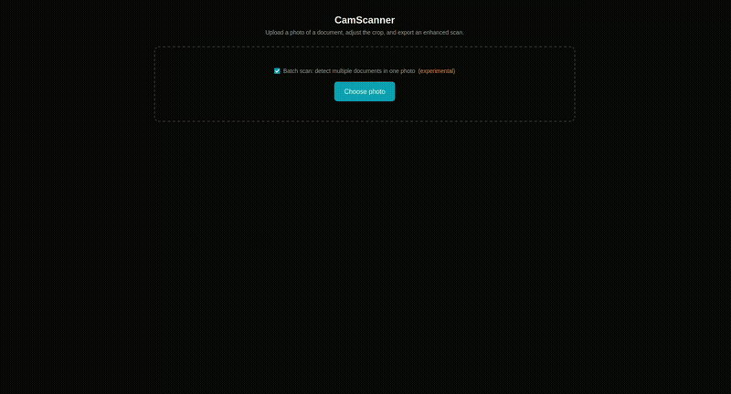
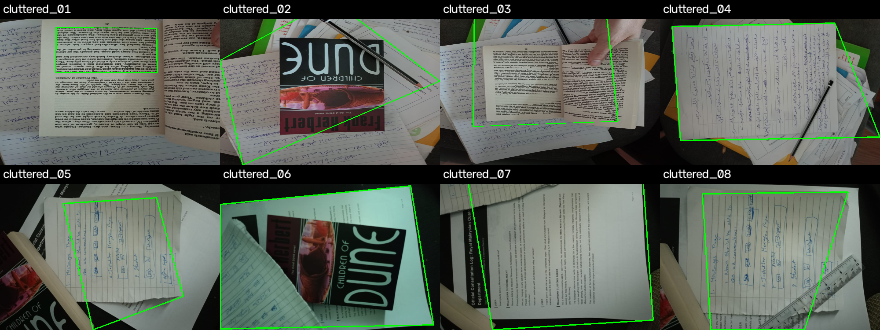
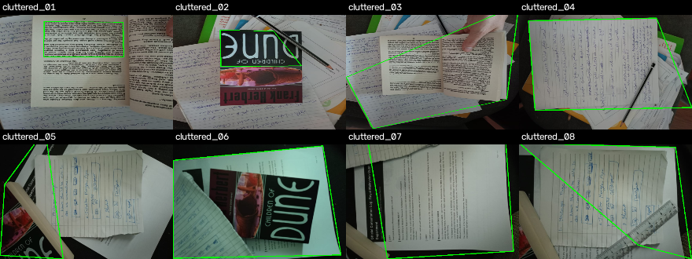
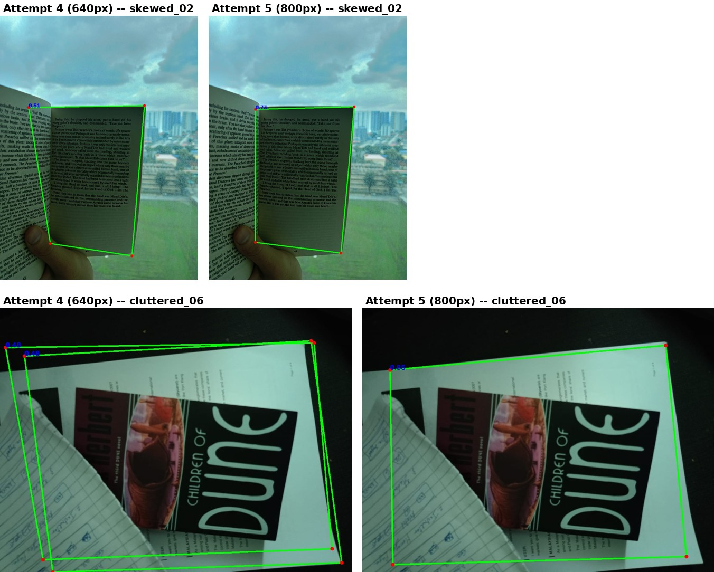
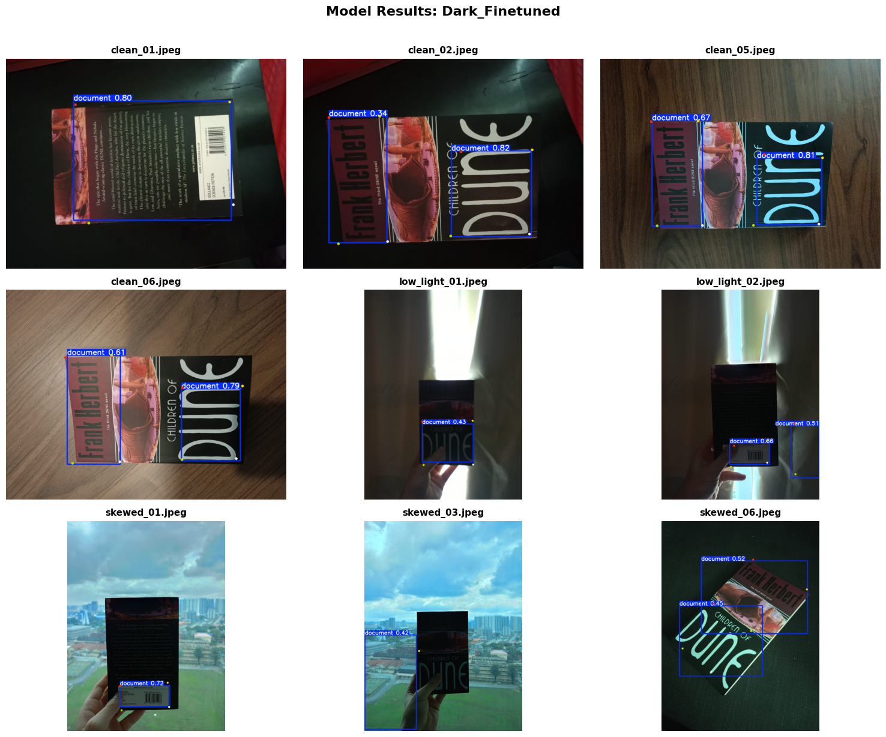
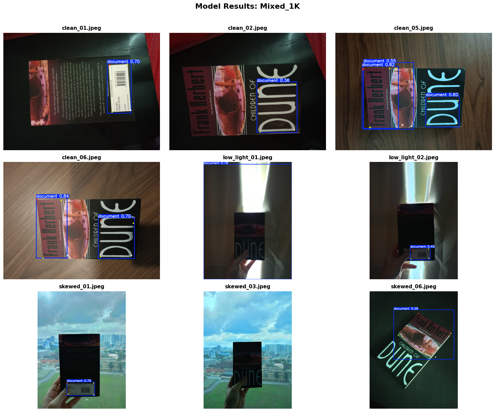

# CamScan

A CamScanner-style document scanner: takes a photo of a document against an arbitrary
background and outputs a clean, flattened, enhanced scan. A Next.js frontend and
FastAPI backend wrap a Python detection/warp/enhance pipeline.

The core challenge is **document boundary detection**. Rather than shipping a single
naive method, this project built and compared multiple classical CV approaches, a
segmentation stretch goal (SAM), five trained YOLO-pose corner-detection models, and
two further dark-data finetuning experiments on top of the chosen model, before
settling on the current production model — see [Experimental history](#experimental-history)
for the full comparison.



*A skewed photo (held up against a window, real perspective distortion) auto-detected
by the production model, the crop manually fine-tuned, enhancement strength pushed up,
and exported straight to PDF.*

**Full demo video:** [youtu.be/xu7ZK6jGJMM](https://youtu.be/xu7ZK6jGJMM)

## Pipeline

1. Preprocess (grayscale, blur)
2. Edge detection (Canny) — used by the classical fallback methods
3. Document boundary detection (`camscan/pipeline.py:detect_boundary`):
   - Primary: `yolo26_doccorner_pose` — a YOLO26s-pose model that regresses the 4
     document corners directly (see [Experimental history](#experimental-history))
   - Fallback, if the primary method finds nothing: every classical method
     (`baseline`, `aspect_ratio`, `contrast_score`) is run, and the single
     best-scoring quad across all of them is kept — not just whichever runs first
   - Last resort: the full frame, if every method returns nothing
4. Perspective transform (4-point warp to a flat rectangle)
5. Orientation correction (coarse 90°-rotation fix, then deskew) and enhancement
   (adaptive thresholding / contrast)
6. Output the processed scan

## Project layout

```
camscan/               Core pipeline (preprocess, edges, boundary detection, warp, enhance)
  boundary/             One module per detection method (baseline, aspect_ratio,
                         contrast_score, sam_boundary, yolo26_doccorner_pose)
api/                    FastAPI backend (detect / preview / enhance / export)
frontend/               Next.js frontend (upload, manual quad correction, export)
tests/                  pytest suite -- fallback logic, corner/IoU/letterbox math,
                         one end-to-end smoke test (see Tests below)
model/                  Trained model attempts (attempt 5, current production model;
                         plus two dark-data finetuning runs on top of it, not yet in
                         production -- see Experimental history)
Paper_Corner_Detection.ipynb
                         Colab notebook used to train the models -- attempts 1-3,
                         attempt 5/production, and the two dark-data finetuning runs
                         (does not include attempt 4) -- see Experimental history
data/raw/               Self-collected test set (clean / cluttered / low_light / skewed)
data/results/           Comparison outputs (gitignored, regenerated by compare.py)
docs/progress_log.md    Hour-by-hour experiment log — the full story behind every
                         decision below, including the ones that didn't pan out
Dockerfile              Production image (Railway) -- onnxruntime only, no torch
requirements.txt        Full local-dev dependencies (training, comparisons, export)
requirements-deploy.txt Trimmed runtime-only dependencies used by the Dockerfile
```

## Setup

```bash
python3 -m venv venv
source venv/bin/activate
pip install -r requirements.txt
```

`requirements-sam.txt` has separate instructions for the optional SAM comparison
method (`torch`/`torchvision` are device-specific, so they're not in the main
requirements file).

### Run the CLI

```bash
python -m camscan.pipeline path/to/photo.jpg -o scan.png
```

### Run the full stack

```bash
# backend
uvicorn api.main:app --reload

# frontend (separate terminal)
cd frontend && npm install && npm run dev
```

### Run the tests

```bash
python -m pytest tests/
```

Covers the fallback score-and-pick logic (`camscan/pipeline.py`), IoU/corner-ordering/
letterbox math (`camscan/boundary/yolo26_doccorner_pose.py`), and an end-to-end smoke
test of `camscan.pipeline.scan()`. If your machine has a system-wide ROS install, its
pytest plugins can conflict with this project's venv (`ModuleNotFoundError: No module
named 'lark'` or similar) -- run with `PYTEST_DISABLE_PLUGIN_AUTOLOAD=1` prefixed if so.

### Run the comparison suite

```bash
python compare.py   # scores every method in ALL_METHODS against data/raw/, saves
                     # per-image debug overlays to data/results/debug/
```

## Test set

`data/raw/` holds 38 self-collected photos across four conditions: `clean` (14),
`cluttered` (8), `low_light` (9), `skewed` (7). Every method comparison in this
project is scored against the same 38 images, both by an automated proxy (found a
non-fallback quad covering 10–98% of the frame) and, where noted, by manual visual
audit — the automated proxy can tell "found *a* quad" from "found nothing," but not
"found the *right* quad," which turned out to matter a lot (see the log).

## Experimental history

Full details, dead ends, and the reasoning behind every number below are in
[`docs/progress_log.md`](docs/progress_log.md). Summary:

### Classical methods

| method | clean | cluttered | low_light | skewed | overall |
|---|---|---|---|---|---|
| baseline (largest 4-point contour) | 9/14 | 0/8 | 1/9 | 1/7 | 11/38 |
| + aspect-ratio-constrained candidates | 13/14 | 7/8 | 7/9 | 5/7 | 32/38 |
| + inside/outside contrast scoring | 12/14 | 8/8 | 4/9 | 2/7 | 26/38 |

Baseline's failure mode: it locks onto the largest closed contour regardless of
whether it's actually the document (e.g. a barcode sticker on a book cover), since
raw area/shape alone can't tell a real document boundary from an incidental
rectangle. Contrast scoring (Zhukovsky et al., 2020 — score candidate quads by how
different the pixels just inside vs. just outside the boundary look) helps in some
conditions but is still limited by uneven lighting; no single method dominates every
condition.

<table>
<tr><td><br><sub><b>baseline</b> — cluttered (0/8 automated): no content check at all, locks onto whatever closed contour is largest</sub></td>
<td><br><sub><b>+ contrast scoring</b> — cluttered (8/8 automated, clearly fewer on visual inspection): several of these still clip into background clutter (04, 07, 08) despite passing the automated area/fallback check</sub></td></tr>
</table>

**Why `aspect_ratio` (32/38) scores higher than the production YOLO model (~27-28/38)
here, and why that's not the deciding factor:** the score above is an *automated*
proxy — it only checks "found a non-fallback quad covering 10-98% of the frame," which
can't tell a quad that's roughly the right size from a quad that's actually on the
document. The `contrast_score_cluttered.png` sheet above is a direct example: it
scores 8/8 automated, but visually inspecting it shows several quads (04, 07, 08)
clipping into a second document or ruler/background object in frame — a confidently
wrong answer the automated check can't catch, not a real success. Manually auditing
overlays against what they actually detect (see `docs/progress_log.md`) knocked
classical methods' effective scores down more than the YOLO models' — e.g. attempt 2's
automated 32/38 audited down to 28/38 for the same reason. Classical methods' failures
tend to be **confidently wrong** (a plausible-looking but incorrect quad); the YOLO
model's failures tend to be **honest misses** (no detection at all, correctly
triggering the fallback chain) — worse on paper, safer in a product where a
wrong-but-confident crop is harder for a user to catch than an obvious failure.

### SAM (MobileSAM, box-prompt segmentation)

A learned-segmentation stretch goal, prompted with a large box covering most of the
frame so it segments the dominant object rather than the background. Landed at 23/38
— better than any single classical method, but **worse than the production YOLO
model (~27-28/38)**, for a structural reason: SAM answers *"what is the object"* (a
pixel mask), not *"where are its corners"* — getting from a mask to a usable quad
still needs a separate geometric fitting step (`_mask_to_quad`'s `cv2.minAreaRect`),
which loses precision on cluttered/ambiguous scenes the same way the classical methods
do. A trained keypoint-regression model skips that step entirely by predicting the 4
corners directly. Fine-tuning SAM for this task specifically would also need the same
corner-labeled dataset the YOLO models used — so there's no labeling-effort argument
for choosing SAM over a pose model either.

A second-prompt pooling variant (seeding a tighter second box from the classical
candidate generator) was tried to fix SAM's cluttered-scene weakness specifically, and
reverted after a full audit showed it introduced new confidently-wrong answers
(previously honest fallbacks became wrong-but-claimed-successful) for one modest,
still-imperfect fix elsewhere — a net negative, not an improvement.

### Trained YOLO-pose corner detectors (5 attempts)

Direct 4-corner keypoint regression. Attempts 1-3 trained on a Roboflow-hosted
dataset (`Paper-Corner-Detection-2`); attempts 4-5 moved to a larger Hugging Face
dataset (`mapo80/DocCornerDataset`) instead — see the per-attempt notes below.

| attempt | base model | imgsz | epochs | audited score | outcome |
|---|---|---|---|---|---|
| 1 | yolo26n-pose | 640 | 50 | 0/38 | keypoint output structurally broken (labeling/export bug upstream) — kept in the project history for honesty, not usable |
| 2 | yolov8n-pose | 640 | 50 | 28/38 | first working learned method — direct corners, no classical refinement needed |
| 3 | yolo26n-pose | 640 | 50 | — | superseded by attempt 4, never wired into the pipeline |
| 4 | yolo26n-pose | 640 | 50 | ~28/38 (raw) | became production model ahead of attempt 5 |
| **5 (current)** | **yolo26s-pose** | **800** | **80** | **27/38 (raw)**, near-identical to attempt 4 | **larger backbone, visibly tighter/cleaner quads on skewed and cluttered images** — chosen for quad quality, not raw recall |

Attempt 1's failure was a genuine, documented "the comparison can't measure this
model" result rather than a silently-dropped data point — see the log for how that
was diagnosed. Attempts 2 and 4 were both real working checkpoints at different
points in the project; the repo has since been consolidated to drop their files and
keep only attempt 5's, as the single production model, rather than carrying multiple
large checkpoints from superseded attempts. (Two further checkpoints, finetuned on
top of attempt 5 rather than superseding it, are kept alongside it — see
[Dark-data finetuning experiments](#dark-data-finetuning-experiments-not-in-production)
below.)

**How attempt 5 was chosen over attempt 4 despite a near-identical raw score:**
raw detection count alone couldn't separate them (27/38 vs 28/38 — within noise), so
the tie-break was visual quad quality on the same images, side by side:



*Top row (`skewed_02`):* attempt 4 (conf 0.51) draws a quad whose top edge cuts
diagonally across the *facing* page instead of following this page's actual top
edge — a confidently-wrong boundary, not a miss. Attempt 5 (conf 0.73) follows the
true page edge cleanly, with meaningfully higher confidence.

*Bottom row (`cluttered_06`):* attempt 4 produces two overlapping, jittery boxes over
the same physical page (conf 0.48 each — the near-duplicate-detection issue
`BATCH_DEDUP_IOU_THRESHOLD` exists to filter out in the batch-scan path). Attempt 5
produces one clean, tight quad at conf 0.85, precisely following the page's real
edge even against the cluttered background (a notebook page and a second book cover
underneath).

This is the same "don't trust the raw score alone" principle applied to comparing two
close model checkpoints, not just to classical-vs-learned: when two methods are close
on paper, look at what they actually draw.

### Fallback architecture

Originally an ordered chain (`baseline` → `aspect_ratio` → `contrast_score`, first
non-`None` result wins) tried whenever the primary model found nothing. This could
pick a badly-fit quad from an earlier method even when a later method in the same
chain had a clearly better one for the same image. Reworked into **score-and-pick**:
every method in the chain runs, and the single best-scoring quad (by the same
inside/outside contrast score used by `contrast_score.py`) wins across all of them.

### Dark-data finetuning experiments (not in production)

After attempt 5 shipped, two further finetuning runs were done on top of it —
`model/yolo26_mixed_1k_run` and `model/yolo26_polygon_dark_finetuned` — both starting
from attempt 5's weights (`yolo26s_doc_corner_10k/weights/best.pt`) and continuing
training on additional data, rather than training from scratch:

| run | extra data | epochs | notes |
|---|---|---|---|
| `yolo26_mixed_1k_run` | 1K images, mixed conditions (`DocCorner_Mixed_1K`) | 25 | general-purpose continued finetuning |
| `yolo26_polygon_dark_finetuned` | 1K images specifically **filtered for dark/low-light conditions** (`DocCorner_DarkFilter_1K`) | 20 | targeted at the project's known weakest condition, with milder color-jitter/rotation augmentation to match darker, more uniform source images |

**Training notebook:** [`Paper_Corner_Detection.ipynb`](Paper_Corner_Detection.ipynb)
is the Colab notebook actually used to train these, kept as a record rather than
cleaned up into a single canonical script. It covers, in order: the original
Roboflow-hosted dataset pull; attempt 1 (commented out — the run that produced the
collapsed-keypoint checkpoint described above) and attempts 2/3 on that Roboflow
dataset; then a separate "Hugging Face Dataset" section using `mapo80/DocCornerDataset`
that builds the YOLO-format dataset (10k train / 1k val / 1k test) and trains
`yolo26s_doc_corner_10k` — `yolo26s-pose`, `imgsz=800`, `epochs=80` — **this is
attempt 5, the current production model**, just not labeled "attempt 5" in the
notebook itself (it predates that naming, from when the model folders were later
reorganized — see `docs/progress_log.md`); and finally the dark/mixed
dataset-construction and training cells for `yolo26_mixed_1k_run` and
`yolo26_polygon_dark_finetuned` (both loading `yolo26s_doc_corner_10k/weights/best.pt`
as their starting point), plus the side-by-side comparison cell that produced the two
contact sheets below (`docs/dark_finetuned_comparison.png`/`mixed_1k_comparison.png`,
copied from the notebook's own `data/results/Dark_finetuned.png`/`Mixed_1k.png`
output). **What it does not cover:**
attempts 1–3 under the Roboflow section were run against a different, smaller dataset
lineage (`Paper-Corner-Detection-2`) than attempts 4/5 (`DocCornerDataset`), and
attempt 4 specifically (the yolo26n-pose/640px/3k-image run that preceded attempt 5
in production) isn't in this notebook at all — it was a separate run, documented only
in `docs/progress_log.md`.

**Finding: dark-condition-specific data in the finetuning set measurably helps the
model on low-light images.** Both finetuned checkpoints pick up a confident detection
on `low_light_01`/`low_light_02` (0.43–0.79 confidence) where the production attempt-5
model — trained without a dark-filtered slice of data — is comparatively weaker in
this exact condition (`low_light` has consistently been the hardest bucket for every
method in this project, see [Known limitations](#known-limitations)). This is
consistent with what the training curves show too: both runs converge to a very high
pose mAP50-95 (~0.99 on their own validation splits) within just a handful of epochs,
confirming the underlying attempt-5 backbone finetunes quickly and effectively when
given data that targets a specific weakness rather than a general reshuffle.

**Why neither is used in production yet.** Visually auditing both runs' outputs side
by side (9-image contact sheets across the same clean/low_light/skewed images,
generated by the notebook's own comparison cell) shows a real regression: both
finetuned models tend to **fragment a single book/document into multiple overlapping
detections** instead of one clean quad — e.g. `clean_02`, `clean_05`, and `clean_06`
all come back as two separate "document" boxes (one over the spine/author-text region,
one over the title graphic) rather than a single box spanning the whole cover. The
production attempt-5 model does not have this problem on the same images.

<table>
<tr><td><br><sub><b>yolo26_polygon_dark_finetuned</b> — confident on both low_light images, but fragments clean covers into overlapping boxes (`clean_02/05/06`)</sub></td>
<td><br><sub><b>yolo26_mixed_1k_run</b> — same fragmentation pattern on clean covers, weaker/more fragmented on `low_light_02` than the dark-filtered run</sub></td></tr>
</table>

A rough head-to-head:

| condition (sampled) | attempt 5 (production) | `yolo26_mixed_1k_run` | `yolo26_polygon_dark_finetuned` |
|---|---|---|---|
| clean covers (`clean_02/05/06`) | one clean quad per document | fragments into 2 overlapping boxes | fragments into 2 overlapping boxes |
| low_light (`low_light_01/02`) | weaker/fallback-prone | confident single detection | confident single detection |
| skewed against sky (`skewed_01/03`) | handles well (see attempt 4 vs 5 comparison above) | no detection (fallback) | no detection (fallback) |

This is the same principle applied throughout this project's history (see the
attempt-4-vs-5 quad-quality comparison and the classical-methods audit above): a
model that "detects more" isn't automatically better if what it detects is
messier. Neither finetuned checkpoint has been run through the full audited 38-image
`compare.py`/manual-audit process attempt 5 went through, so there's no apples-to-apples
score yet — this table is a qualitative spot-check on the sampled images above, not a
final verdict. Fragmenting a document into multiple boxes is also a worse failure mode
for this pipeline specifically, since `yolo26_doccorner_pose.py` expects a single
best quad per document; picking wrong among several overlapping candidates risks a
worse crop than the classical fallback chain would have produced on the same image.

**How the classical fallback chain does on the exact same 9 images**, for a fair
three-way comparison — not just against attempt 5, but against the same
`baseline`/`aspect_ratio`/`contrast_score` score-and-pick chain used whenever the
production model finds nothing:


*Green = the chain's best-scoring quad (no fallback-to-full-frame triggered on any of
these 9).* The chain overshoots badly on all three clean covers (`clean_01/02/06`) —
its quad sweeps past the book onto the desk/red-blanket background rather than
following the actual cover edge, the same "confidently wrong" failure mode documented
throughout this project's classical-methods history. On both `low_light` images and
all three `skewed` images it locks onto the window/sky/floor instead of the book
entirely. Both finetuned YOLO checkpoints, despite their fragmentation problem, still
find *something* resembling the right region on every one of these 9 images (see the
two contact sheets above) — fragmented-but-roughly-right beats confidently-wrong-region,
even though neither is production-ready. This reinforces why the fallback chain is
used only when the primary model finds nothing, not as a default: it is a worse
starting point than either finetuned model here, just a better one than nothing.

Given all three data points together — attempt 5's clean single-quad behavior, the
finetuned models' fragmentation-but-better-recall, and the classical chain's
confidently-wrong quads on the same images — **the project keeps
`yolo26_doccorner_pose` (attempt 5) as `DEFAULT_METHOD`** rather than swapping in
either finetuned checkpoint or leaning further on the classical chain.

You can reproduce the classical-fallback-vs-learned comparison directly:

```bash
python -m camscan.pipeline data/raw/clean/clean_02.jpeg --method aspect_ratio -o /tmp/classical.png
python -m camscan.pipeline data/raw/clean/clean_02.jpeg --method yolo26_doccorner_pose -o /tmp/yolo.png
```

**Why this is still a promising direction, not a dead end:** both finetuning runs
show the underlying architecture responds well and quickly to condition-targeted data
(20-25 epochs to near-saturated validation metrics), which suggests the fragmentation
regression is more likely a data/labeling artifact of the two new finetuning sets
(`Dark_Books_Dataset_YOLO`/`DocCorner_Mixed_1K`, both built by a custom per-sample
filter/shuffle over the same `mapo80/DocCornerDataset` attempt 5 itself was trained
on — see the notebook note above) than a ceiling on what this model family can do.
The most promising path forward implied by these two runs: build a properly labeled,
single-quad-per-document dark/low-light dataset (same labeling convention as attempt
5's own training data, not a separately-constructed filtered subset) and finetune
attempt 5 on that specifically — combining attempt 5's clean single-quad behavior with
the low-light robustness these two experiments demonstrate is possible, rather than
picking one property or the other.

### Production model: ONNX conversion

Attempt 5 is exported to ONNX (`model/attempt 5_yolo26s/weights/best.onnx`,
`imgsz=800`) and loaded via ONNX Runtime rather than the raw PyTorch checkpoint —
measured ~2.4x faster per-image inference on CPU, and verified to produce numerically
identical detection/fallback behavior to the `.pt` model across the full 38-image
test set.

### Deployment: dropping ultralytics/torch from the served path

`yolo26_doccorner_pose.py` originally loaded the ONNX model through
`ultralytics.YOLO(..., task="pose")` — simple, but `ultralytics` pulls in
`torch`+`torchvision` as hard dependencies even though inference itself never touches
PyTorch, which bloated the deploy image to **5.92GB**. Rewritten to call
`onnxruntime.InferenceSession` directly: letterbox preprocessing (aspect-preserving
resize + pad) and NMS-output postprocessing (the exported graph's `(1, 300, 18)`
output: box + confidence + class + 4 keypoints) are hand-implemented in
`_letterbox`/`_run_model`, replacing what the `ultralytics` wrapper used to do
internally. Verified numerically identical to the `ultralytics`-backed version to
sub-pixel precision on real images before the swap, and the full 38-image regression
suite (`compare.py`) reproduced the exact same scores afterward. Combined with
switching to `opencv-python-headless` and a deploy-only `requirements-deploy.txt`
(see the Dockerfile), the image dropped to **679MB** — an 8.7x reduction.

The app is deployed as a Docker container on **Railway** (backend,
`camscan-production-a411.up.railway.app`) and **Vercel** (frontend, `frontend/`).
`requirements.txt` keeps the full local-dev dependency set (training, `.pt`-based
comparison methods, ONNX export via `ultralytics`); `requirements-deploy.txt` is the
trimmed runtime-only set actually installed in the Docker image.

### Tests

`tests/` covers the logic most likely to silently regress: the fallback
score-and-pick behavior (`test_pipeline_fallback.py` — includes a regression test
reproducing the exact bug the score-and-pick rework fixed), `_order_corners`/
`_box_iou`/`_letterbox`'s geometry (`test_yolo26_doccorner_pose.py`), and an
end-to-end smoke test of `camscan.pipeline.scan()` on a real photo
(`test_pipeline_smoke.py`). Run with `python -m pytest tests/` (see
[Run the tests](#run-the-tests)). Classical CV methods' exact pixel outputs aren't
unit-tested — `compare.py`'s scored regression suite already covers those, and
they're inherently visual/fuzzy in a way unit tests don't suit well.

## Known limitations

- `low_light` backlit/silhouette photos are the weakest condition across every
  method tried — a fundamentally weak edge/contrast signal, not a tuning gap.
- Multi-document batch detection (`camscan.pipeline.detect_batch`) is implemented
  but unverified against real multi-document photos — treat as experimental.
- Page-curl dewarping is not implemented; only flat perspective warp + deskew.
